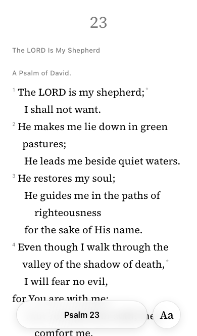
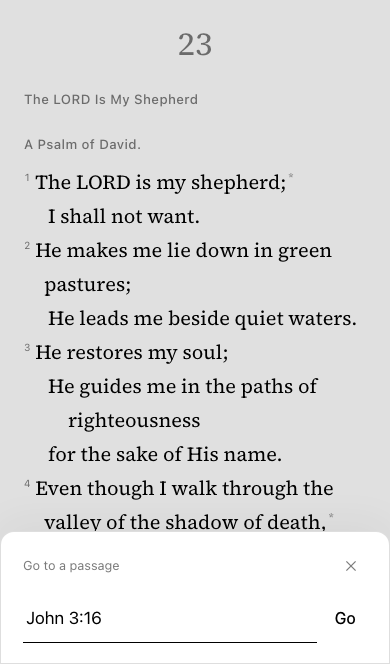
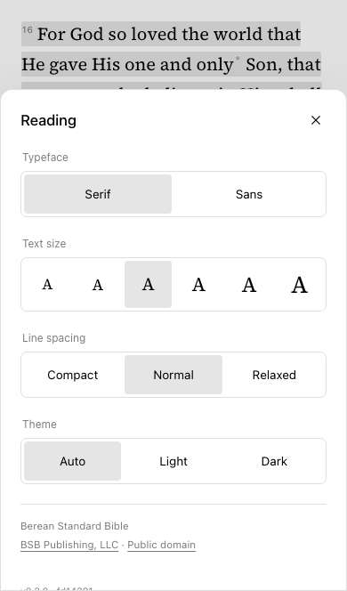

# Instant Bible

Ever needed to access a Bible verse in the moment but your Bible app took forever to load? And then when it finally did open, you had to click through a bunch of slow screens to get to the verse you wanted? NO MORE! Instant Bible is built for one thing, and one thing only: to access and share scripture as fast as possible.

- **Type the reference.** No slow and clunky book-chapter-verse picker.
- **Works offline.** The Berean Standard Bible (BSB) is bundled and ready to read.
- **Installable on mobile.** Add to your home screen for quick access.
- **Powerful on desktop.** Keyboard shortcuts make it even faster to access and share scripture.
	- `/` opens the reference picker.
	- Left and right arrows navigate between chapters.
	- Press Ctrl+C or Cmd+C to copy selected text to the clipboard.
	- `Esc` closes open modals or deslects text.
- **No bloat.** Only the features you need and no more.

**[Read now →](https://timunrau.github.io/instant-bible/)**

## Screenshots







## Updates

Tap the version at the bottom of **Aa → Reading** to check for updates.

## Self-hosting

Run your own copy with Docker and Compose:

```bash
git clone https://github.com/timunrau/instant-bible.git
cd instant-bible
docker compose up -d
```

Open [localhost:8080](http://localhost:8080). Set `BIBLE_PORT` to use another port.

To update:

```bash
git pull
docker compose up -d --build
```

## Development

For local development, checks, deployment, and releases, see the [developer guide](docs/DEVELOPMENT.md).

Product behavior is documented in the [product specification](docs/PRODUCT_SPEC.md).

## License

Application code is licensed under [MIT-0](LICENSE). Scripture, bundled fonts, and dependencies retain their own licenses.

Scripture attribution and license links are available in **Aa → Reading**. Font licenses are bundled in `public/fonts`.
